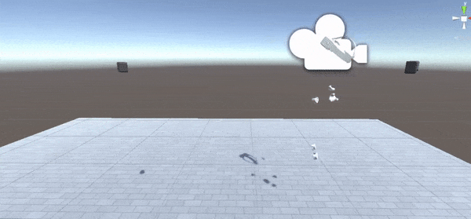
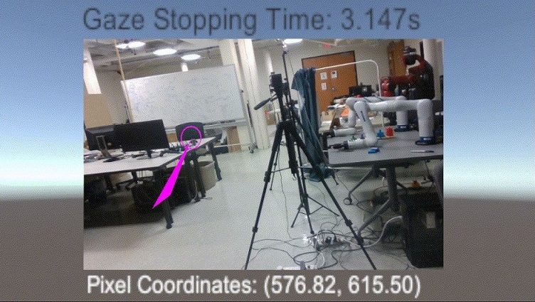
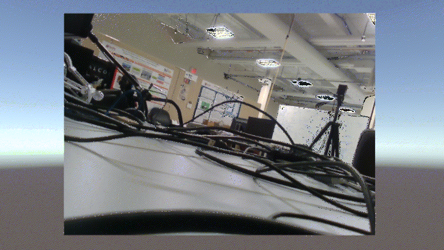

# VIVE-Motion-Capture-With-Wearable-Cameras

This wearable camera system consists of HTC VIVE VR headset, trackers and various cameras. It can be used for **human motion capture**, to **track human gaze input** (if you have VIVE Pro Eye), to **provide camera stream from various cameras**, or any combination of these modules.

## Setup

This repository is tested in Unity 2020+, but other Unity version should work as well.

#### **Start a new project**

In Unity hub, start a new empty 3D project. Name it "**VIVE-Motion-Capture-With-Wearable-Cameras**" (or other name you want).

#### **Install packages**

Depending on the module you use, you will need different packages:

- For any of these modules, the basic package you need is "[SteamVR Plugin](https://assetstore.unity.com/packages/tools/integration/steamvr-plugin-32647)". Please make sure you put it in your Unity asset, import and download it in this project. After downloading, navigate to `Window -> SteamVR Input` and follow the instruction to generate necessary files.
- If you want to use Realsense camera package in Unity, download [package](https://github.com/IntelRealSense/librealsense/releases/download/v2.50.0/Intel.RealSense.unitypackage) provided by RealSense and import it to the assets through `Assets -> Import Package -> Custom Package...`. Please be noted that you don't have to use this package as Unity provides its own webcam package.
- For eye tracking, please follow these steps to [set up tobii sdk](https://vr.tobii.com/sdk/develop/unity/getting-started/tobii-htc-dev-kit/#step-4-import-the-tobii-xr-sdk).

#### **Download**

Git clone this repository. Merge the downloaded folder into your project folder, or put all the files and folders of this repository under your project folder. Open the corresponding scene you need in **Scenes** folder. Make sure your <u>SteamVR</u> is launched and all the components are paired before running any scenes.

# Demo Presentation

This module includes three parts, which are **Motion capture**, **Eye tracking** and **Multi-Camera Streaming and Switching**, respectively. 

## 1. Motion Capture

Motion capture is achieved by tracking VIVE trackers that are attached to human body.

- Open scene **MotionCapture**.
- In the game object hierarchy, for each tracker, enter the serial number in the inspector. Serial number can be found in your SteamVR floating window by `≡ -> Devices -> Manage Vive Trackers -> ManageVive Trackers`.
- Launch SteamVR and make sure the headset and all the controllers are properly paired. Do a room setup in steamVR if the objects appear wrongly posed.
- Hit play in Unity, and you should be able to see the trackers and the headset tracks properly.

## 2. Eye Tracking

Eye tracking is provided by HTC VIVE Pro headset which includes tobii eye tracking and tracks real-time gaze trajectory. 

- Open scene **EyeTracking**.
- Hit play in Unity, and you should see your gaze is tracked and shown on the canvas.

Two main functions are developed to help identify the gaze data: 

- Present the real-time coordinates of the gaze on canvas in pixel unit, whose origin is at bottom left corner.

- Calculate the staying time when gaze is fixed to a certain area for a period.

- A debugging mode for this two functions is also provided to display or hide these two indications. Press **G** for hiding/showing gaze point and **T** for hiding/showing pixel coordinates and gaze time duration text. 

  

Here are the detailed explanation.

- **Obtain Pixel Coordinates**

  In the world coordinate system, we attach Main Camera to the origin (0, 0, 0), and canvas is set to (0, 0, 100). The vector of the gaze is provided by SDK of VIVE in C# script. We hereby design such an algorithm that gets the coordinate of the intersect point **P** between gaze ray and canvas, and then  calculates the screen coordinates of **P** in pixel unit by comparing the relative position to the bottom left corner point and also the width & height of the image.  

- **Calculate Gaze Staying Time**

  For this function, we have set a range denoted by the input x and y to represent the region where we think the user is staring at an area in a concentrate way without his/her gaze moving out of the region. Once his/her gaze is at a valid position in the image, we begin to calculate the gaze time. And once his/her eyes move out of the region, we will recalculate it right then.

## 3. Multi-Camera Switching

There are two ways to load streaming from various cameras depending on the type of cameras you use. If you are using regular cameras, you can use web cam package provided by Unity. Specifically, if all the cameras are Realsense camera, you can choose to use the Realsense camera package to load streaming. 

- Open scene **WebCamStreaming** or **RealsenseStreaming**.
  - If you use web cam packages in **WebCamStreaming**, navigate to `Scripts` game object and make sure `Use Predefined Cameras` under the <u>Web Cam Stream</u> script is unticked. Hit play in Unity and all the camera names will be loaded in the `Device Names`. Copy down the names of the cameras you want to use, stop Unity, tick `Use Predefined Cameras` and enter these names in the `Device Names` now.
  - If you use realsense camera package in **RealsenseStreaming**, navigate to `RealSense Canvas -> Camera -> RealSense Device` for each camera you use, and enter your Realsense camera serial number. Navigate to `Scripts` and put the `ColorImage` game object under each camera you use into `Camera Canvases` under the <u>Realsense Stream</u> script.
- Hit play in Unity, and you should see a camera view on the canvas.

There are two ways to switch frames displayed on canvas

- **Switch with Keyboard**

  Press the keys 'H', 'L', 'R', 'C', 'W' on keyboard to switch to 'Head', 'Left-Hand', 'Right-Hand', 'Clavicle' and 'World' cameras accordingly.

- **Switch with Speech**

  We use speech SDK provided by Unity. The captured keywords are: 'Head', 'Left', 'Right', 'Clavicle' and 'World', which cater to different cameras correspondingly.

  

  If your microphone is not working, you may need to activate the microphone based on your platform. For windows, Open up Unity Hub and make sure the module **Universal Winodws Platform Build Support** has been installed already. Open Unity Project, select `File -> Build Settings -> Universal Windows Platform -> Player Settings -> Publishing Settings -> Capabilities -> Mircophone` and tick it.
